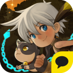

<a href="/" style="font-size: 30px;">🏠</a>

# Jung Wonhee,  Game programmer

_Hello World !_

## Tech Stack

## Contributions

| `Elbrisa` | `SpiritCatcher` | `DragonFlight` 
| --- |  --- | --- |
| |  |  

| `Weather-bot` | `Tube` | `Freety` |
| --- |  --- | --- |
|  |  |  |

## Career
2018.03 ~ Linegames Game Programmer 
2018.01 ~ 2018.02 Kakaogames Game Programmer (Intern) 
2017.03 ~ 2017.06 RGPKOREA Yogiyo IT Team (Intern) 
2017.03 ~ 2017.12 S.O.P.T 20~21th Programmer 
2011.03 ~ 2018.02 Major in CSE, Soongsil University 