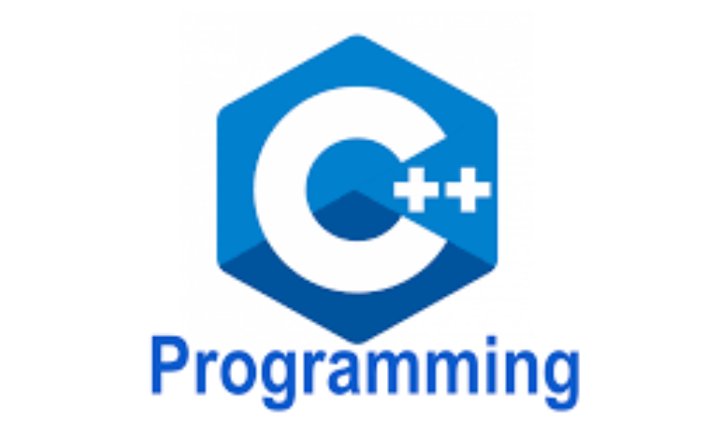

<div style="text-align: center;">
    <span style="font-size:11px; color:grey">
        이 정적 페이지는 PC 버전에 최적화되어 있습니다.  
    </span>
</div>

---

## 입출력
iostream 라이브러리 내부의 std 이름공간(namespace)에는 입출력과 관련된 함수들이 존재한다.  
cin에서 tab, space, enter는 데이터의 경계로 인식한다.  
cout에서 >> 연산자를 통해 연속적인 데이터 입력이 가능합니다.  
endl은 개행 뿐만 아니라 입력 버퍼를 지우는 기능을 합니다.  
## 헤더
C에서는 stdio.h와 같이 .h 확장자가 붙었습니다.  
cpp에서도 .h 파일이 include가 가능합니다.  
하지만 최신 표준과 구분하기 위해 헤더파일의 확장자를 붙이지 않습니다.  
따라서 `#include<iostream>`과 같이 표현합니다.  
## 함수 오버로딩, 오버라이딩
오버로딩을 위해선 함수명과 매개 변수의 타입 혹은 개수가 달라야합니다.
## swap 함수
cpp은 블록 단위의 scope를 가지고 있습니다.  
따라서 swap 함수는 아래와 같이 call by reference를 이용해 구현합니다.
~~~cpp
void swap(int *a, int *b) {
    int temp = *a;
    *a = *b;
    *b = temp;
}

int main(void) {
    int input1, input2;
    cin >> input1 >> input2;
    swap(&input1, &input2);
    cout << input1 << " " << input2 << endl;
}
~~~
## 디폴트 매개변수
함수 호출 시, 실제로 인자가 들어 오지 않으면 default로 넣어줄 수 있습니다.  
당연하게도 인자 수 <= 매개 변수 수입니다.  
다만, 함수 선언이 정의 이전에 있다면 디폴트 매개변수는 선언부에서 정의하고 정의부는 선언이 필요 없습니다.
```cpp
#include <iostream>
using namespace std;
int default_test (int a = 1, int b = 2);
int main() {
    cout << default_test();
}
int default_test(int a, int b) {
    return a+b;
}
```
## 인라인 함수
일반적으로 함수는 스택 메모리 공간을 사용합니다.  
키워드 `#define`을 통해 함수를 정의하면 컴파일 단계 전인 전처리기에서 어셈블리 언어로 치환이 되므로 메모리를 절약할 수 있습니다.  

## namespace
코드를 합치면 변수명, 함수명 등이 중복될 수 있습니다.  
클래스, 함수 등을 namespace로 감싸면 모듈화가 가능합니다.  
namespace의 요소에는 :: 연산자를 통해 접근합니다.  

## using
매번 `std::cout`으로 접근하는 것은 비효율적입니다.  
이 키워드를 사용하면 현재 코드에서 직접 접근이 가능합니다.  

## ::
이 연산자는 이름 공간 접근 뿐만 아니라 전역 공간 접근을 의미하기도 합니다.  
```cpp
int a = 2;
int main() {
int a = 1;
cout << ::a; // a = 2
}
```

## 레퍼런스
C 언어에서 주소 연산자로 사용되었던 &는 cpp에서 좌항에도 사용됩니다.  
좌항에 선언되면 별칭의 의미로 메모리 공간에 다른 이름을 붙이는 의미입니다.  
레퍼런스를 활용하면 swap 함수를 아래와 같이 좀 더 간단히 구현할 수 있습니다.  
```cpp
#include <iostream>
using namespace std;
void swap (int &x, int &y) {
    int temp = x;
    x = y;
    y = temp;
}
int main(void) {
    int a = 10, b = 20;
    swap(a, b);
    cout << a <<" " << b << endl;
}
```
이로 인해 매개변수로 인한 주소 공간을 아낄 수 있습니다.  
하지만 레퍼런스의 오용으로 원본 데이터가 본인도 모르게 바뀔 수 있습니다.  
또한 함수 같은 scope를 가지는 지역 변수를 리턴할 수 없습니다.

## new와 delete
C언어에서는 동적 메모리 할당을 위한 malloc과 free 함수가 존재합니다.  
cpp에서는 new와 delete 키워드가 존재합니다.  
delete를 적절하게 하지 않으면 메모리가 부족해 new가 동작하지 않을 수 있습니다.  
이런 경우를 대비해 new가 제대로 동작하지 않으면 null을 반환하는 것을 이용해야합니다.  
하지만 빈번한 null 체크는 비효율적이기 때문에 전처리 flag를 둬서 개발 모드에서만 사용하는 것이 바람직합니다.

## 클래스
클래스는 C언어의 구조체의 Superset입니다.  
멤버 변수(attribute)와 멤버 함수(Method)로 구성됩니다.  
클래스의 기본 접근 제한자는 private인 반면, 구조체는 public하다고 볼 수 있습니다.

## 추상화
현실 세계의 존재하는 무언가를 데이터 + 기능으로 정의한 것을 말합니다.

## 인스턴스
클래스를 객체로 생성한 것입니다.  
인스턴스와 객체의 의미는 거의 유사합니다.

## 생성자와 소멸자
cpp는 디폴트 생성자를 제공합니다.  
사용자 정의 생성자는 클래스와 이름이 같아야하고 리턴 타입이 없어야 합니다.  
생성자를 통해 생성된 멤버 변수 혹은 멤버 함수가 동적인 메모리를 참조한다면,  
다시 말해 heap 영역의 메모리를 사용하고 있다면 scope가 끝나도 제대로 메모리 회수가 되지 않습니다.  
이러한 경우를 대비해 cpp는 사용자 정의 소멸자를 제공해 명시적으로 메모리를 회수하도록 유도합니다.  
생성자와 달리 함수 오버로딩이나 매개 변수 사용이 불가능합니다.  
오직, 소멸자의 기능만 기대하기 때문입니다.  
자바나 자바스크립트와는 달리 멤버 변수의 선언과 초기화를 동시에 할 수 없습니다.  
따라서 생성자를 통해 멤버 변수를 초기화하는 데 사용하기도 합니다.  
생성자나 소멸자는 따로 구현하지 않으면 디폴트로 생성이 됩니다.  
반대로 말하면 따로 구현하다면 디폴트 생성자-소멸자는 생기지 않습니다.  
## this
자기 참조 포인터인 this는 자신을 참조하는 용도로 사용됩니다.  
```cpp
#include <iostream>
using namespace std;
class Data {
    int number;
    char *name;
    public:
        Data(int number, char *name) {
            this->number = number;
            this->name = name;
        }
        void print() {
            cout << number << " " << name << endl;
        }
};
int main() {
    Data data(100, "name");
    data.print();
    return 0;
}
```
위와 같이 this를 사용해 손쉽게 멤버 변수의 값을 바꿀 수 있습니다.

## friend 
cpp만의 독특한 키워드인 friend는 단방향적으로 선언되며 피선언된 (친구) 클래스는
선언된 클래스의 private 제한제에도 접근이 가능합니다.  

## 디폴트 복사 생성자
cpp는 디폴트 생성자 및 소멸자 뿐만 아니라 복사 생성자를 제공하여 값을 복사할 수 있습니다.  
하지만 멤버 변수가 값이 아닌 주소를 가질 경우 shallow copy를 하기 때문에 문제가 발생할 수 있습니다.  
예를 들어 B라는 객체에 A 객체를 복사하여 생성하였을 경우 A와 B는 shallow copy가 됩니다.  
얼핏 보면 문제가 없어보이지만 소멸자가 호출되는 시점에서 문제가 생길 수 있습니다.  
A와 B 객체의 scope가 해제되면서 메모리를 해제해야 하는데 A 혹은 B의 heap 메모리를 이미 해제해버렸기 때문에 
컴파일 에러가 발생합니다.  
따라서 경우에 따라 사용자 정의 복사 생성자를 구현해 deep copy를 해야합니다.  
생성자가 오버라이딩이 가능한 것을 활용해 아래와 같이 deep copy를 구현할 수 있습니다.  
```cpp
Car::Car(const Car& c) {
    name = new char[strlen()c.name)+1];
    strcpy(name, c.name);
    color = new char[strlen()c.color)+1];    
    strcpy(color, c.color)
}
```
복사생성자가 호출되는 경우는  
1. 기존 생성된 객체로 새로운 객체를 초기화할 때  
2. 함수 호출 시 객체를 값에 의해 전달할 때  
3. 함수 내에서 객체를 값에 의해 리턴할 때    

## const
일반적으로 const는 선언과 동시에 초기화애햐 합니다.  
포인터의 경우 위치에 따라 상수화 되는 부분이 다릅니다.  
```cpp
ex) const int* p // 포인터가 가르키는 값 상수화
ex) int* const p // 포인터 값 상수화
```
const를 잘 활용하여 변수에 제약을 준다면 보다 안정적인 프로그램을 만들 수 있습니다.  
## 멤버 이니셜라이저
const는 클래스의 멤버 변수에 할당할 수 없습니다.  
객체가 생성되어 메모리 할당 시에 쓰레기 값이 들어가 버리기 때문입니다.  
```Car(char* color, int number) : color(_color)```  
위와 같이 생성자 함수 매개 변수 옆에 멤버 이니셜라이저을 붙여 const의 기능을 수행하게 할 수 있습니다.  
생성자 함수 몸체보다 이니셜라이저가 먼저 실행되는 것을 이용해 구현하는 구조입니다.  
## static
main 호출 전에 메모리에 실리기 때문에 클래스에서 생성된 객체들이 공유할 값, 함수가  
필요할 때 사용합니다.  
## explicit
명시적으로 호출만 허용할 때 붙이는 키워드입니다. 
## mutable
const로 된 멤버 변수의 값을 바꿀 수 있습니다.  
코드에 혼선이 갈 수 있으므로 가급적이면 사용하지 않는 것이 좋습니다.  


