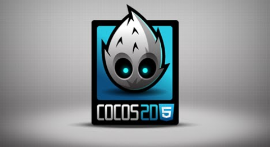
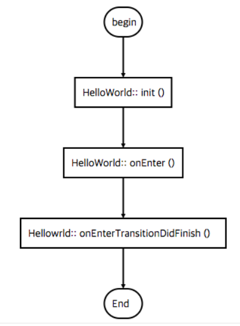
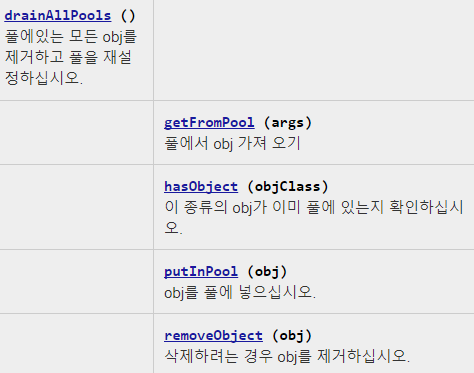

<div style="text-align: center;">
    <span style="font-size:11px; color:grey">
        이 정적 페이지는 PC 버전에 최적화되어 있습니다.  
    </span>
</div>

---

## 생명주기


## 좌표계
기본적으로 setPosition(0, 0)은 왼쪽가장하단을 가리킵니다.
## 앵커포인트(anchorpoint)
이미지를 그릴 기준점입니다.  
기본으로 (0.5, 0.5) 설정되어 있고 x, y 좌표가 300, 300일때  
그 점에 이미지의 중간 위치가 오게 됩니다.  
만약 (1, 1)일 경우 (600, 600) 점부터 이미지를 그리게 됩니다.  
## z-Order
Sprite가 겹치는 경우 순서를 정해줍니다.  
설정하지 않으면 0이고 숫자가 높을 수록 위에 출력됩니다.  
Sprite는 주로 Layer에 addChild를 해주지만  
Sprite에 Label, Sprite 등도 addChild 할 수 있습니다.  
## FPS(Frame Per Seconds) 
Draw Call은 CPU가 GPU에게 보내는 Draw 요청입니다.  
특정 Draw Call을 넘으면 프레임 저하로 이어집니다.  
Draw Call을 줄일 수 있는 방법  
1) SpriteBatchNode  
Draw Call을 한꺼번에 보냅니다.  
Batch Node에 속한 Sprite를 한 번에 이동 가능합니다.  
따라서 하나의 Sprite를 여러 번 그릴 때 사용합니다. (Auto Batching)  
2) Cache  
다른 Scene이나 Layer에서 이미지 리소스를 자주 Draw Call할 경우에,  
이미지를 중복하여 그릴 때 매번 읽는다면 비효율적입니다.  
메모리에 사용할 이미지를 올려 놓고 필요할때 사용하는 방식입니다.  
Texture Atlas  
GPU는 이미지 요청을 가로 * 세로 2의 n승으로 저장합니다.  
따라서 남는 공간이 발생하고 이 공간에 다른 리소스를 넣는 작업입니다.  

## Draw Call 관리의 중요성  
무작정 Draw Call을 낮추기 위해 모든 배경을 하나로 합쳐 보는 것은 비효율적입니다.  
이미지 호출 횟수가 적은 데도 GPU에 함께 올리는 것에 대한 기회 비용이 생기기 때문입니다.  
따라서 신중한 설계가 필요합니다.   
Frame Rate : 1초당 프레임 수  
일반적으로 60 Frame, 모바일 게임의 경우 100Frame을 넘지 않습니다.  
Delta time, Draw Call의 영향을 받습니다.  
Delta Time (업데이트와 업데이트 사이의 시간)  
60프레임 사양의 스마트폰 vs 30프레임 사양의 스마트폰  
프레임이 낮은 사양의 스마트폰에서 같은 퍼포먼스를 보여주고 싶다면  
Frame rate에 dt를 곱해준다면 같은 거리를 이동할 수 있습니다.  
## GUI
Label - 텍스트 출력을 위한 객체입니다.
```javascript
var colorLayer = new cc.LayerColor(cc.color(142, 29, 42));
this.addChild(colorLayer);
//cc.LabelTTF(보여줄 문자열, .ttf, (폰트 사이즈), (dimensions), (hAlignment), (vAlignment))
this.Label1 = new cc.LabelTTF('Default Font Label','', 32);
this.Label3 = new cc.LabelTTF('Label With Stroke','Abduction', 32);
//this.Label3.enableStroke(cc.color(r,g,b),10?); - 텍스트 강조 효과
//cc.LabelTTF의 enableStorke는 매개변수로 (스트록할 색깔(cc.color(), 스트록할 크기)를 받는다.
this.Label3.enableStroke(cc.color(0,0,0),10);
//this.Label4.enableShadow(cc.color(0,0,0), 50, 50); - 텍스트 그림자 효과
//cc.LabelTTF의 enableShadow는 매개변수로 (cc.Color, cc.Size, blur,size(num), shadowsize(null|num)
this.Label4.enableShadow(cc.color(0,0,0), 50, 50);
//cc.LabelBMFont(텍스트, .fnt파일, 가로, 정렬, imageOffset) 이미지폰트? 그라데이션?
this.Label5 = new cc.LabelBMFont("Bitmap Font", res.BM_Font);0
```
Menu - 사용자의 클릭에 대한 상호 작용을 지정할 수 있습니다.
Menu는 1개 이상의 MenuItem으로 구성되어 있습니다.
```javascript
//MenuItem1 생성 cc.MenuItemLabel(라벨이름, 'selector', target)
this.MenuItem1 = new cc.MenuItemLabel(label,'onMenuClicked',this);
//MenuItem2 생성 cc.MenuItemImage(기본이미지, 선택되었을 때의 이미지, 선택해제했을 때 이미지  ,콜백,  목적지함수 ) 
this.MenuItem2 = new cc.MenuItemImage(res.MenuItemImage_Normal,res.MenuItemImage_Selected,null,'onMenuClicked',this);
```
OtherUI
```javascript
// extensions 모듈 추가해줘야 합니다.
"modules" : ["cocos2d","extensions”]
this.uiButton = new ccui.Button(res.ButtonImage,res.ButtonImage_Selected);
//체크박스를 생성합니다.
ccui.CheckBox(backGround, backGroundSeleted, (cross), (backGroundDisabled), (frontCrossDisabled), (texType))
this.uiCheckBox = new ccui.CheckBox(res.CheckBox_Normal,res.CheckBox_Selected);
```

## Actions
이미지 객체들을 움직이기 위한 다양한 함수를 제공합니다.  
move 함수에 대해서만 설명 드리자면  
현재 좌표가 (360, 570) 일때,  
moveTo(x, y) - 절대 좌표로 동작합니다.  
moveBy(x, y) - 상대 좌표로 동작합니다.  
절대 좌표 - 현재 위치에서 (x, y) 좌표로 이동합니다.  
수행 후 좌표 (x, y)  
상대 좌표 - 현재 위치에서 (x, y)만큼 이동합니다.   
수행 후 좌표 (360 + x, 570 + y)  
```javascript
<Move>
var action = cc.moveBy(2, cc.p.(size.width -40, size.height-40));
var action2 = cc.moveTo(2, cc.p.(size.width -40, size.height-40));
```

이 외에도 jump, rotation, scale, skew, tint, bezier, easing, cardinal spline 등 다양한 동작 함수 등을 제공합니다.  
```javascript
<Jump>
var action= new cc.JumpBy(2, cc.p(300,0),50(높이),4(점프수))
var action2 = new cc.JumpBy(2,300,0(y좌표),50(높이),4(점프수))

<Rotation> //현재 각도와 일치하면 돌지 않습니다. 항상 갈수있는 빠른 위치로 이동합니다.
var action = new cc.RotateBy(2초동안, 360도)
var action2 = new cc.RotateTo(2초동안, 360도) 

<Scale>
var scale = new.ccScaleTo(2, 0.5, 2)
To x, y 값 무시하고 목적지로 이동합니다. 
By 현재값을 곱해줍니다.

<Skew> 
var skew = new cc.SkewTo(2, 37.2, -37,2);

<Tint> // by만 제공, (초, R, G, B)
var action = new cc.TintBy(2,-127,-255,-127); 

<Bezier> 
var bezier = [cc.p(0,windowSize.height / 2),cc.p(300,-windowSize.height/2), cc.p(300,1))];
var bezierForward = new cc.BezierBy(3,bezier);
var bezierTo = new cc.BezierTo(3,bezier);
``` 
또한 애니메이션 연속 재생 순서 정의 등을 위해 sequences, spawn, schedulers 및 action call back을 제공합니다.

Sequences 예시
```javascript
var action1 = cc.moveTo(2, cc.p(size.width*0.2 , size.height*0.2));
var action2 = new cc.RotateBy(2, 360);
// 시퀀스 : 액션의 순서 (1번 액션, 2번 callFunc수행, 3번 액션2, 4번 callFunc수행)
var seq = new cc.Sequence(action1, cc.callFunc(funct, this), action2, cc.callFunc(funct, this));
//스프라이트에 runAction 함수로 seq의 repeatForever(무제한반복)을 수행한다.
//콜백을 통해 다른 기능도 수행할 수 있따. ex액션수행하고 다음장넘어간다
this.sprite.runAction(seq.repeatForever());
Repeat(3) // 3번 반복한다
```
Spawn 예시
```javascript
//시퀀스는 수행 완료 후 수행 스펀은 병렬적으로 동시 수행
var action1 = cc.moveTo(2, cc.p(size.width*0.2 , size.height*0.2));
var action2 = new cc.RotateBy(2, 360);
var seq = new cc.Spawn([action1,action2]);
this.sprite.runAction(seq.repeatForever());
```
StopAction 예시
```javascript
// 메뉴버튼 클릭 리스너를 달아서 버튼 누르면 spawn을 멈추고 다시 누르면 재시작
var action1 = cc.moveTo(2, cc.p(size.width*0.2 , size.height*0.2));
var action2 = cc.moveTo(2, cc.p(size.width/2 , size.height/2));
this.seq = new cc.Spawn([action1,action2]); //액션 1,2를 병렬 수행
this.sprite.runAction(this.seq.repeatForever());
//isPlaying=true 상태에서 클릭이벤트 발생시
if(this.isplaying) {
    this.sprite.stopAction(this.seq);
    this.label.setString('Play Action');
    this.isplaying=false;
} else { //isPlaying=false 상태에서 클릭 이벤트 발생시
    this.sprite.runAction(this.seq.repeatForever());
    this.label.setString('Stop Action');
    this.isplaying=true;
}
```
Schedulers 예시
```javascript
//스케줄러 업데이트 함수 사용 (인자 모두 생략가능)
this.scheduleUpdate(this, priority, !this._isRunning);
    this.seed=10; 
    this.addChild(this.sprite, 0);
    this.scheduleUpdate();
},
update:function(dt) { 
  if(this.sprite.getPositionX()>cc.winSize.width){
    this.seed=-10;
  } else if(this.sprite.getPositionX()<0) {
    this.seed=10;
  }
//기본 포지션 w/2, h/2에서 +-seed=10을 수행
  this.sprite.setPositionX(this.sprite.getPositionX()+this.seed);
```

## Physics
핵심 개념은 Body와 Shape입니다.  
객체의 Body가 존재해 가시적으로 보이더라도 Shape가 없다면 물리 연산을 적용 받지 않습니다.  
이 [블로그](https://thd0011.tistory.com/category/%ED%94%84%EB%A1%9C%EA%B7%B8%EB%9E%98%EB%B0%8D/COCOS2D-JS 
)에 정말 자세히 설명이 되어 있습니다. 

## 오브젝트 풀링
자주 사용될 오브젝트들을 미리 생성하여 pool에 저장 후 재사용하는 방법입니다.  
매번 객체를 새로 생성하지 않고 pool에서 꺼내 씁니다.  
따라서 불필요한 객체 생성 및 반환 비용(GC에 의한)을 최소화하는 일종의 싱글톤 패턴입니다.

Cocos2d에서는 cc.pool 라이브러리를 제공합니다.  


## 오픈 소스 프로젝트  
FlappyBird: [https://github.com/makeapp/cocoseditor-flappybird]  
PopStar: [https://github.com/makeapp/cocoseditor-popstar]  
FruitNinja: [https://github.com/makeapp/cocoseditor-fruitninja]  
MoonWarriors: [https://github.com/makeapp/cocoseditor-moonwarriors]  
FruitAttack: [https://github.com/makeapp/cocoseditor-fruitattack]  
TestsJavascript: [https://github.com/makeapp/cocoseditor-tests]  
2048: [https://github.com/makeapp/cocoseditor-2048]  
PianoTiles: [https://github.com/makeapp/cocoseditor-piano]  

## 참고 자료
TestCase : http://cocos2d-x.org/js-tests/  
Reference : http://www.cocos2d-x.org/docs/api-ref/js/V3.13/  
develope guide : https://github.com/pjc0247/cocos2d-js-guide  
chipmunk.js : http://wingedrobin.github.io/Chipmunk-js/index.html,  
https://chipmunk-physics.net/documentation.php  
guide of Actions : http://htmlfive.co.kr/html5/xe/tip/8960  


